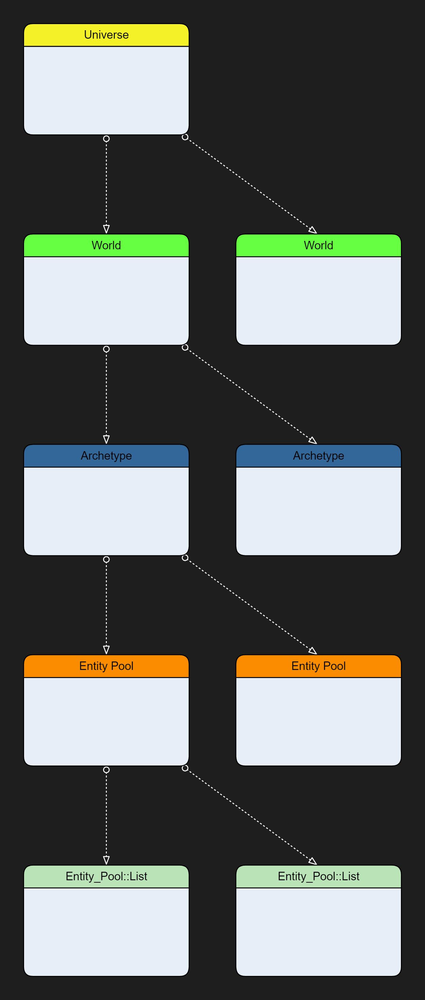

# MECS DataBase Introduction

Basic data base is composed of 5 Levels.

  

### Universe
There is only one instance of this per game app normally. However MECS is created in such a way that you could
event have more of these instances if you like. However it will be a rare case. The main responsibility of the 
universe is to keep track of worlds as well as other top scope knowledge of your app. The universe has no idea
of entities, systems, etc... that is a lower level thing.

### World
A world is where most of the exciting things happen in MECS. Worlds knows about the game graph, archetypes, systems, etc.
Is up to you to decide how many worlds does your app needs. Most times it will be a single one, but you could have more if you wanted.
You could have one for rendering, one for physics, etc. Worlds main responsibility is to deal with Archetypes, and the graph.

### Archetype
Archetypes are a unique set of components that describe an entity. If you add or remove a component you will force the entity to
move to a different archetype. Archetype don't deal directly with storing the entities stead they manage Entity Pools.
Each archetype may have one more Entity pools.

### Entity Pool
Entity pools job is to uniquely group entities that have the same shared component values. Shared components are design to
minimize the memory usage and cache issues. Entity Pools still don't deal with entities directly neither, their job is to manage
the lists which is the real place where the entities are. A pool may have multiple Entity_Pool::Lists.

### (Entity Pool) Lists
A list is a collection of components that describe the entity itself. The list are single allocation of virtual memory space
where the entities will be store ones needed. The pools will try to minimize the wasted memory as well as the coherency of the
list so that there is no gaps. A particular list may belong to a different scene. This makes it easy to for the application
to load and unload scenes.
